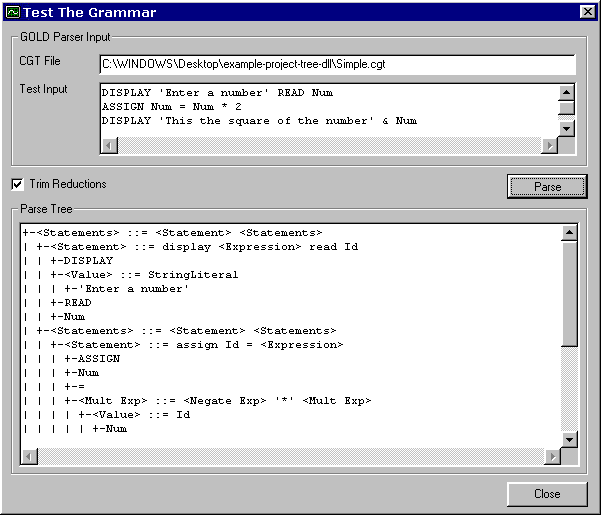



## GOLD Parser Example

### Description

Unlike other parser generators, the GOLD Parser strives to be a development tool that can be used with numerous programming languages and on multiple platforms while maintaining modern design concepts. Modern bottom-up parsers use a Deterministic Finite Automaton (DFA) for identifying different classes of tokens and a LALR(1) state machine to parse them. The actual LALR(1) and DFA algorithms are easy to implement since they rely on tables to determine actions and state transition. Consequently, it is the computing of these tables that is both time-consuming and complex. The GOLD Parser Builder performs this task; reading from a source grammar outline and then computing the appropriate tables. This information is then saved to a Compiled Grammar Table file which can be, subsequently, loaded by the actual parser engine and used.

This is a simple project which loads a Compiled Grammar Table file and draws a parse tree for a given input string. An example grammar called "Simple" is included.

You will need to download a copy of the GOLD Parser Engine DLL from http://www.devincook.com/GOLDParser. This module contains the actual parsing algorithms. The source code for the Engine will be released soon (hopefully next month) in Visual Basic. Until then, the DLL is available. Sorry.
 
### More Info
 

             |
---                |---
**Submitted On**   |2002-02-25 14:08:06
**By**             |[Devin Cook](https://github.com/Planet-Source-Code/PSCIndex/blob/master/ByAuthor/devin-cook.md)
**Level**          |Advanced
**User Rating**    |5.0 (20 globes from 4 users)
**Compatibility**  |VB 5\.0, VB 6\.0
**Category**       |[Miscellaneous](https://github.com/Planet-Source-Code/PSCIndex/blob/master/ByCategory/miscellaneous__1-1.md)
**World**          |[Visual Basic](https://github.com/Planet-Source-Code/PSCIndex/blob/master/ByWorld/visual-basic.md)
**Archive File**   |[GOLD\_Parse58728312002\.zip](https://github.com/Planet-Source-Code/devin-cook-gold-parser-example__1-32250/archive/master.zip)

